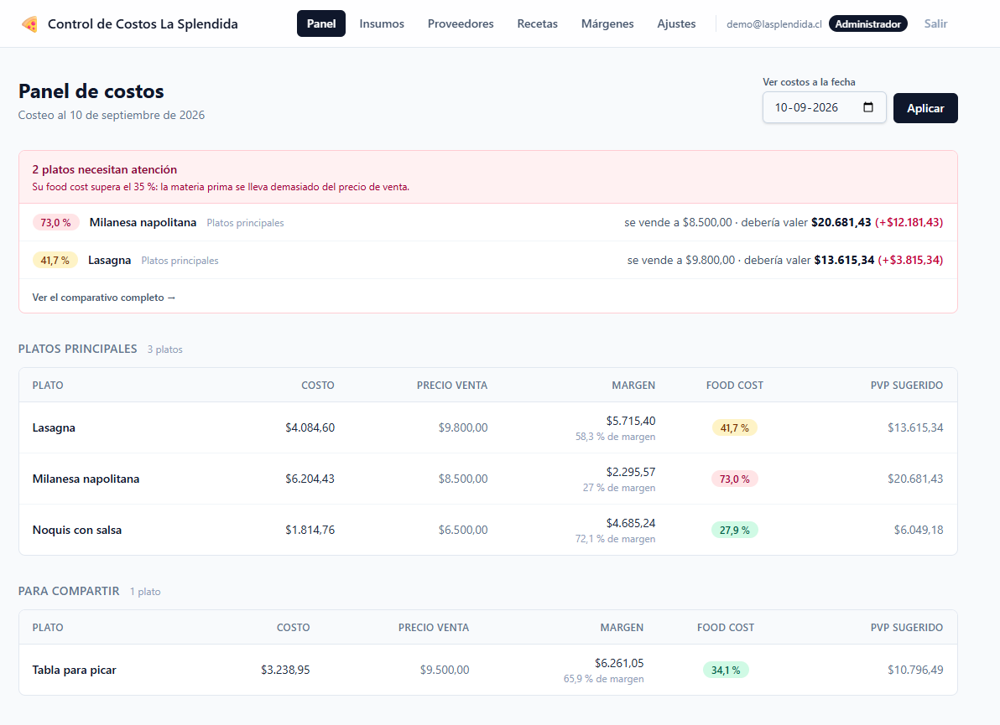
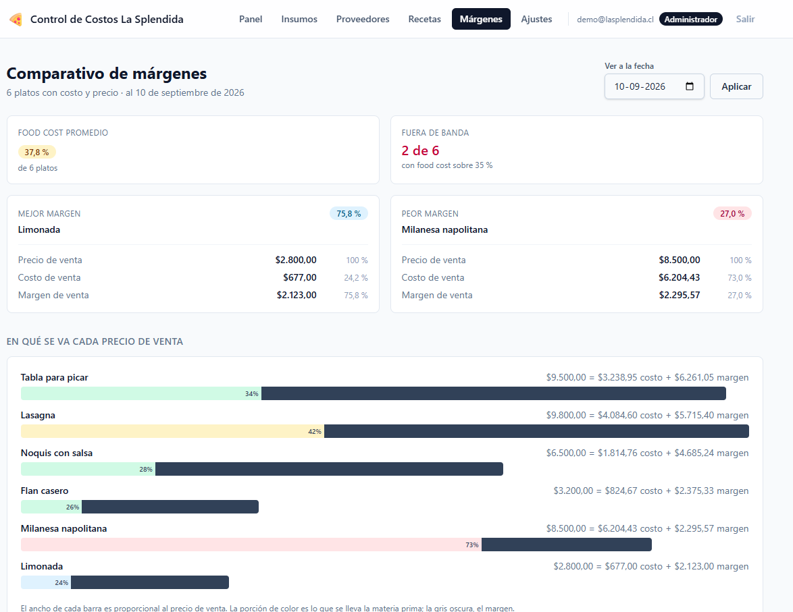
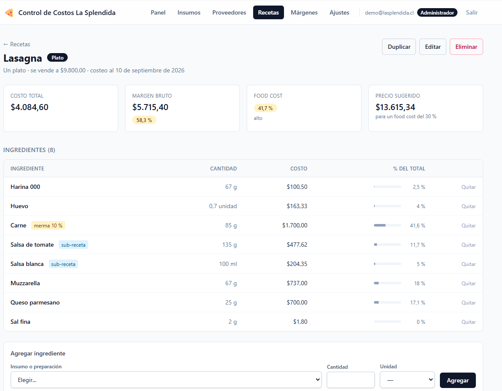
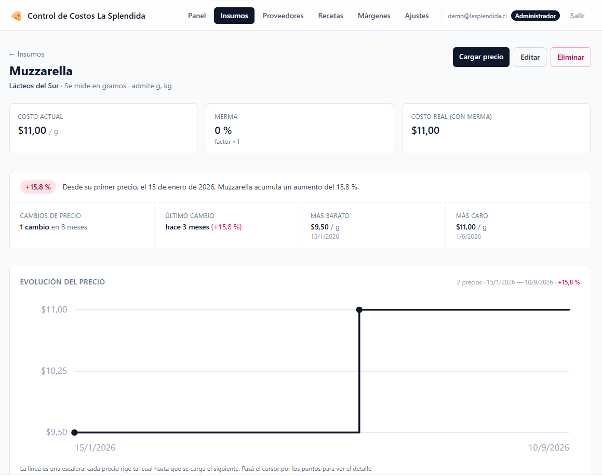
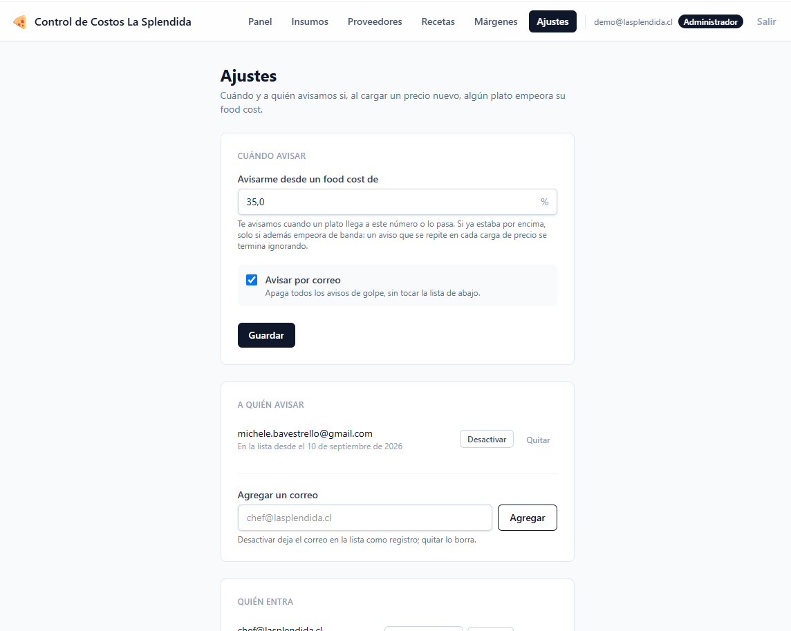
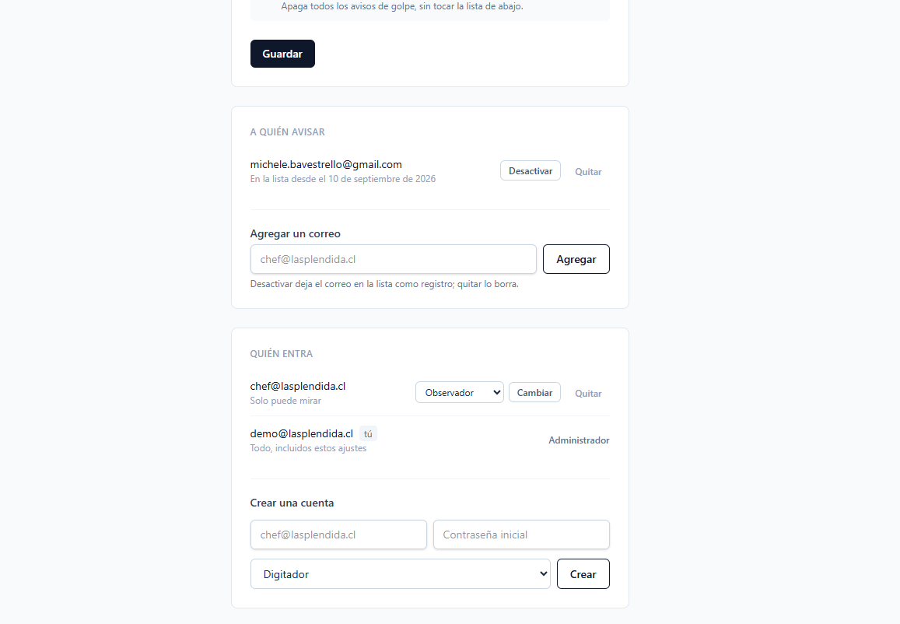

# 🍕 Control de Costos La Splendida

Cuánto cuesta realmente cada plato de la carta, y qué pasa con ese número
cuando sube el precio de un insumo.

**En vivo:** [costos.enmipccorre.dev](https://costos.enmipccorre.dev) — entra con
`demo@lasplendida.cl` / `demo1234` (cuenta de solo lectura).

Un restaurante sabe lo que cobra por una lasaña, pero rara vez sabe lo que
le cuesta: hay que sumar el queso, la carne, la salsa —que a su vez es otra
receta con sus propios insumos—, descontar la merma, y todo eso cambia cada
vez que llega una factura nueva. Esta aplicación mantiene ese cálculo al
día y avisa cuando un plato se vuelve caro.

---

## Capturas

**Panel** — la carta agrupada por sección de la carta, con el food cost de
cada plato y su color según la banda. Arriba, los que se salieron de rango
y cuánto deberían costar.



**Márgenes** — comparativo de toda la carta: mejor y peor margen, en pesos
y en porcentaje.



**Receta** — en qué se va la plata, ingrediente por ingrediente. La salsa de
tomate y la salsa blanca están marcadas como **sub-receta**: son recetas
completas que se costean solas. La carne descuenta un 10 % de merma.



**Insumo** — historial completo de precios, con el gráfico en escalera y un
resumen en palabras de cómo se ha comportado.



**Ajustes** — desde qué food cost avisar, a quién avisarle, y quién entra
con qué permisos.



---

## Qué hace

- **Costea recetas a partir de insumos**, con conversión de unidades
  (kg → g, l → ml, docena → unidad) y descuento de merma.
- **Sub-recetas**: una salsa es una receta que se usa como ingrediente de
  un plato. La profundidad no tiene límite y los ciclos se detectan.
- **Historial de precios**: cada insumo guarda todos sus precios con fecha
  de vigencia. El costo de cualquier plato se puede consultar **a una fecha
  cualquiera**, pasada o futura.
- **Food cost y margen** por plato, con bandas de color y precio sugerido.
- **Comparativo de márgenes** de toda la carta.
- **Aviso por correo** cuando un plato empeora al cargar un precio nuevo.
- **Tres roles**: administrador, digitador y observador.

## Stack

Ruby 3.4.5 · Rails 8.1 · PostgreSQL 18 · Tailwind v4 · Hotwire
(Turbo + Stimulus) · Propshaft · importmap · Solid Queue / Cache / Cable ·
Kamal

Sin Node: Tailwind corre con el binario independiente de `tailwindcss-rails`.

**332 tests, 1071 assertions**, sin fixtures.

---

## Decisiones de diseño

Lo que sigue es el porqué de las decisiones que no son obvias. Es la parte
del proyecto que vale la pena mirar.

### Polimorfismo para las sub-recetas

`Ingrediente#insumable` apunta a un `Insumo` **o** a una `Receta`. Eso
permite que el costeo recursivo quepa en una línea:

```ruby
def costo(fecha: Date.current) = insumable.costo_de(cantidad, unidad, fecha: fecha)
```

Ni `if`, ni dos columnas, ni dos caminos. Un plato que lleva salsa boloñesa
pregunta lo mismo que si llevara queso, y la salsa se costea sola bajando
por sus propios ingredientes.

### Los ciclos se detectan consultando la base, no la asociación

Si la salsa lleva el plato que lleva la salsa, el costeo no termina nunca.
`Receta#depende_de?` recorre el grafo con un `Set` de visitadas.

Primero lo escribí recorriendo la asociación `ingredientes`, y **dejaba
pasar los ciclos indirectos**: la asociación venía cacheada de antes y no
reflejaba lo que se estaba intentando agregar. Ahora consulta la base con
`pluck`. Lo encontró un test, no la lectura del código.

### El costo no se guarda: se recalcula a una fecha

No hay ninguna columna `costo_total`. Cada precio se guarda con su
`vigente_desde`, y el keyword `fecha:` atraviesa todos los métodos de
costeo. Así se puede preguntar cuánto costaba la lasaña en marzo, o cuánto
costará cuando entre en vigor un precio ya cargado con fecha futura.

Un costo guardado es un costo que se desactualiza en silencio.

### Falta el precio → excepción, no cero

Si un insumo no tiene precio cargado a esa fecha, `Insumo#costo_de` lanza
`Insumo::SinPrecio`. Devolver cero sería peor que fallar: el plato
aparecería con un food cost bajísimo y nadie se daría cuenta.

Quien necesita tolerar el hueco lo dice explícitamente: `Receta#costeable?`
captura la excepción y la pantalla muestra "no se puede costear todavía".

### `decimal` y `BigDecimal`, nunca `float`

Todo lo que es dinero o porcentaje usa columnas `decimal` y `BigDecimal` en
memoria. Con `float`, sumar diez veces 0,1 kg no da 1 kg, y ese error
aparece en la factura.

### El gráfico de precios es una escalera, no una diagonal

Un precio rige desde su fecha **hasta que llega el siguiente**. Unir los
puntos con una diagonal dibujaría precios intermedios que nunca existieron.
La escalera dice la verdad: se mantuvo plano, y después saltó.

### Mensaje amable arriba, garantía abajo

Cada regla se escribe dos veces a propósito: como validación de Active
Record, que produce un mensaje entendible, y como `CHECK` o índice único en
PostgreSQL, que nadie puede saltarse —ni una consola, ni un script, ni un
`update_column`.

Los tests lo comprueban en los dos niveles: hay tests que esperan el
mensaje, y tests que esperan `ActiveRecord::StatementInvalid` al forzarlo
por debajo.

### Las políticas de borrado se eligieron por significado

- Un insumo con precios cargados **no se puede borrar**
  (`restrict_with_error`): perderías el historial.
- Un proveedor sí, pero sus insumos **quedan sin proveedor** (`nullify`):
  la mercadería no desaparece porque cambies de distribuidor.

### El aviso compara bandas, no un umbral fijo

La primera versión avisaba al cruzar el 35 %. Al probarla con datos reales
dio **cero avisos** mientras un plato pasaba de 73 % a 130 % —o sea, a
venderse bajo costo—, porque nunca "cruzó" el 35 %: ya estaba encima.

Ahora son dos reglas: avisa si el plato **cruza** el umbral configurado, o
si **ya estaba encima y además empeoró de banda**. La segunda es la que
atrapa el caso urgente.

### Una sola regla de autorización

```ruby
return if puede_escribir?
return if solo_consulta?   # GET, y la acción no es `new` ni `edit`
```

Toda petición que no sea `GET` modifica algo. Como la aplicación es
RESTful, cualquier acción que se agregue mañana nace protegida sin que haya
que acordarse de nada.

Ajustes va aparte y exige administrador incluso para mirar, y eso **no** lo
cubre la regla general: un digitador sí puede escribir, así que sin ese
candado podría crearse una cuenta de administrador. Ese agujero lo encontró
una prueba de mutación, no la lectura del código.

Y nadie puede cambiarse el rol ni borrarse a sí mismo. Con esa única regla
siempre sobrevive al menos un administrador, sin necesidad de contarlos: el
último no puede degradarse, porque nadie puede hacerlo sobre su propia
cuenta.



Quien no puede escribir tampoco ve los botones que no podría usar, ni el
enlace a Ajustes. El servidor rechaza igual —ahí está la seguridad—, pero
ofrecer un botón que va a rebotar es una mentira en la pantalla.

### Un cálculo memoizado, medido antes y después

Todo el costeo desemboca en `Receta#costo_total`: `food_cost`,
`margen_bruto`, `precio_sugerido`, `banda_food_cost` y `costeable?` no
hacen más que preguntarle a él. Sin memoizar, mostrar **una sola** ficha de
plato recorría el árbol entero de ingredientes seis o siete veces.

Medido con la misma carta de prueba (20 insumos, 3 preparaciones, 6 platos,
la mitad con sub-recetas):

| Pantalla | Antes | Después |
|---|---:|---:|
| Panel | 518 | **83** |
| Márgenes | 348 | **63** |
| Recetas | 230 | **80** |
| Ficha de un plato | 113 | **35** |
| Insumos | 26 | 26 |

Insumos no cambia, y está bien: esa pantalla no costea recetas.

Dos cosas que salieron de medir en vez de suponer:

- **La mayoría de esas consultas nunca llegaban a PostgreSQL.** Rails cachea
  por petición: preguntar dos veces lo mismo se responde de memoria. Así
  que el problema no era la red, era la CPU de volver a construir los
  objetos una y otra vez. El diagnóstico cambió al ver los números.
- **Memoizar `Insumo#precio_vigente` no sirvió.** Ahorraba tres consultas en
  una sola pantalla que ya estaba en ocho. Se revirtió: una optimización
  que no mueve ningún número es estado de más que puede quedarse viejo.

El precio de memoizar está documentado y probado: el objeto conserva su
cálculo, así que `reload` tuvo que aprender a olvidarlo. Eso lo descubrió
un test, no la lectura del código —`reload` recarga atributos y
asociaciones, pero no sabe nada de las variables de instancia—.

`test/integration/consultas_test.rb` fija un presupuesto por pantalla.
No vigila el número exacto: avisa si algo vuelve a dispararse.

### El dominio está en castellano, incluidas las tablas

`Receta`, `Insumo`, `Proveedor`. Rails pluraliza en inglés, así que
`config/initializers/inflections.rb` corrige las reglas latinas que dejaban
`receta` sin pluralizar y `proveedor` como `proveedors`.

---

## Cómo levantarlo

Necesitas Ruby 3.4.5 y PostgreSQL corriendo.

```bash
git clone <url-del-repo> control_costos
cd control_costos
bundle install
bin/rails db:prepare
bin/rails db:seed        # carta de ejemplo: 23 insumos, 5 proveedores, 9 recetas
bin/dev
```

En http://localhost:3000, con la cuenta que crea el seed:

```
demo@lasplendida.cl / demo1234
```

## Tests

```bash
bin/rails test
```

**No hay fixtures.** Los datos de prueba se construyen con los mismos
modelos que usa la aplicación (`test/test_helper.rb`), porque las fixtures
se insertan con SQL crudo saltándose validaciones y callbacks. En este
dominio eso significaría escribir a mano valores que el sistema deriva
—como `costo_por_unidad_base`— y terminaríamos comprobando nuestra propia
aritmética en vez de la del código.

### Prueba de mutación

Que un test pase no prueba que pueda fallar. Durante el desarrollo, cada
bloque de tests se verificó rompiendo el código a propósito —cambiar un
`<` por un `<=`, borrar una guarda, quitar un parámetro de
`params.expect`— y comprobando que algún test lo detectara.

Encontró unos diez tests que no podían fallar, y dos fallos reales:

1. **Una escalada de privilegios**: un digitador podía crear cuentas de
   administrador. La regla general no lo detenía porque escribir sí podía.
2. **Una discrepancia entre el código y la interfaz**: la etiqueta decía
   "cuando el food cost **supere** 35 %", pero el código incluía el 35
   exacto. Ningún test tocaba el borde.

## Modelo de datos

```
Proveedor 1──* Insumo 1──* PrecioInsumo        (historial con vigente_desde)
                  ▲
                  │ insumable (polimórfico)
                  │
Receta 1──* Ingrediente
   ▲              │
   └──────────────┘  una receta puede ser ingrediente de otra
```

`Configuracion` (fila única) guarda el umbral de aviso;
`Destinatario` la lista de quién lo recibe; `User` tiene `rol`.

## Despliegue

En producción en [costos.enmipccorre.dev](https://costos.enmipccorre.dev), con **Kamal 2**
sobre un VPS de AWS Lightsail (2 GB): la aplicación y PostgreSQL 17 en
contenedores, imágenes en GitHub Container Registry, y el certificado de
Let's Encrypt lo pide y renueva kamal-proxy solo. `db/produccion/init.sql`
crea las tres bases extra que Rails 8 usa para cola, caché y cable.

La cuenta pública es observadora a propósito: cualquiera puede mirar,
nadie puede romper la demo.

## Qué falta

- **Bajar las consultas reales del panel**, que siguen en 48: una por
  insumo para buscar su precio vigente. Se podrían traer todas de golpe
  con una sola consulta y filtrar por fecha en Ruby.
- **Tests de sistema con Capybara.** El filtrado de unidades con Stimulus
  está probado por sus atributos, no ejecutando el JavaScript.
- **SMTP real** para los avisos en producción; hoy en desarrollo se
  escriben en `tmp/mails/`.
- **Cargar ventas**, para pasar del margen por plato a la rentabilidad
  real de la carta.
